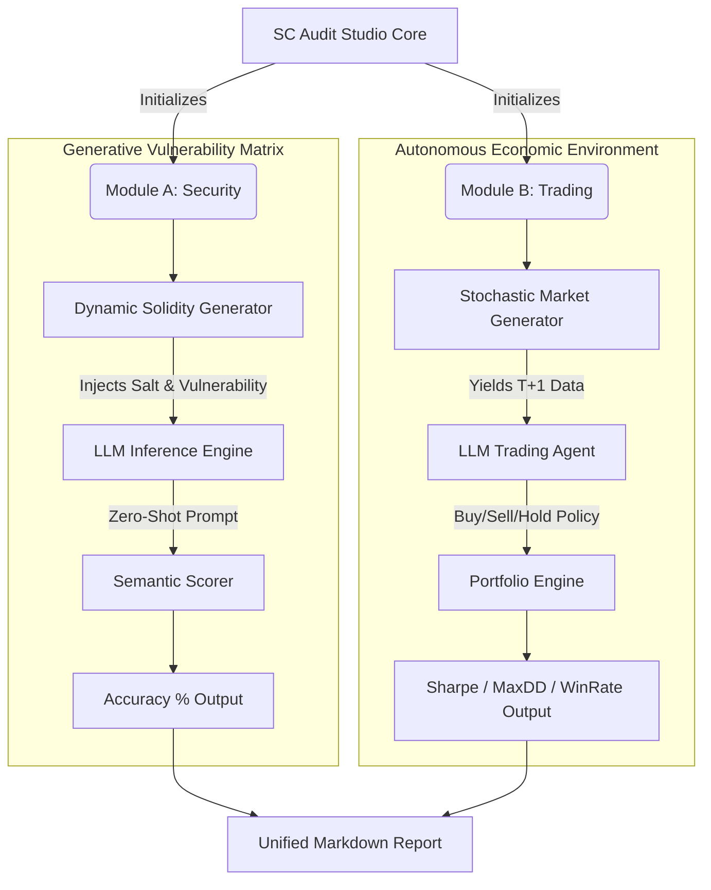

<div align="center">
  <h1>SC Audit Studio Benchmark</h1>
  <p><b>A World-Class LLM Evaluation Suite for Web3 Security & Autonomous Trading</b></p>
  
  [](https://opensource.org/licenses/MIT)
  [](https://www.python.org/downloads/)
</div>

<br>

## 📌 Executive Summary

**SC Audit Studio Benchmark** is a next-generation evaluation framework designed to test Large Language Models (LLMs) in high-stakes Web3 environments. Traditional benchmarks suffer from static datasets, leading to model overfitting and data contamination. 

We solve this by introducing **Dynamic Generative Evaluation**:
1. **Smart Contract Security**: Evaluates vulnerability detection by synthetically generating valid, logic-rich Solidity contracts with randomized salt to bypass memorization.
2. **Economic Autonomy**: Evaluates trading acumen in zero-knowledge, dynamically generated market simulations (random walk volatility), forcing models to react to true *out-of-sample* data.

---

## 🏛️ System Architecture

The benchmark operates through two independent, mathematically rigorous modules, orchestrated by a unified scoring suite.



---

## 💎 The Two Modules

### Module A: Generative Smart Contract Security
Unlike static databases (e.g., Slither datasets), this module dynamically generates `Solidity ^0.8.0` contracts containing critical vulnerabilities:
- `Reentrancy`
- `Access Control Violations`
- `Arithmetic Over/Underflow`
- `Tx.Origin Phishing`
- `Timestamp Dependence`

Each test generates a unique SHA256 footprint, guaranteeing that the model is reasoning about the code mechanics, not recalling pre-trained data strings.

### Module B: Out-of-Sample Trading Simulation
A simulated crypto market environment utilizing stochastic random-walks and volatility constraints. The LLM acts as an autonomous agent receiving state observations (balance, holdings, recent price vectors) and must output structured JSON decisions (`action`, `percentage`).
Performance is evaluated via institutional-grade metrics:
- **Sharpe Ratio** (Risk-adjusted return)
- **Maximum Drawdown** (Capital preservation)
- **Win Rate** (Execution accuracy)

---

## 📈 Commercial & Economic Rationale

This framework provides highly actionable intelligence for three core enterprise sectors:

1. **Hedge Funds & Prop Trading**: Validate the logical consistency and risk-management capabilities of AI agents before allocating real capital.
2. **Web3 Audit Firms**: Quantify which frontier models are reliable enough for integration into CI/CD security pipelines.
3. **LLM Providers**: Demonstrate superior multi-modal economic reasoning and zero-shot problem solving in logically dense scenarios.

---

## ⚙️ Quick Start

### 1. Prerequisites
Ensure you have Python 3.10+ installed. Clone the repository and install dependencies:

```bash
git clone https://github.com/harleysederholm-alt/scaudit.git
cd scaudit
pip install -r requirements.txt
```

### 2. Environment Configuration
Provide your LLM API credentials. If omitted, the suite will run a local mock simulation for demonstration purposes.

```bash
# macOS/Linux
export OPENAI_API_KEY="sk-your-api-key"

# Windows (PowerShell)
$env:OPENAI_API_KEY="sk-your-api-key"
```

### 3. Execution
Launch the unified benchmark suite:

```bash
python benchmark_suite.py
```

The system will generate a detailed `benchmark_results.md` report containing the performance matrix of the evaluated models.

---

<div align="center">
  <i>Engineered for uncompromising analytical rigor.</i>
</div>
